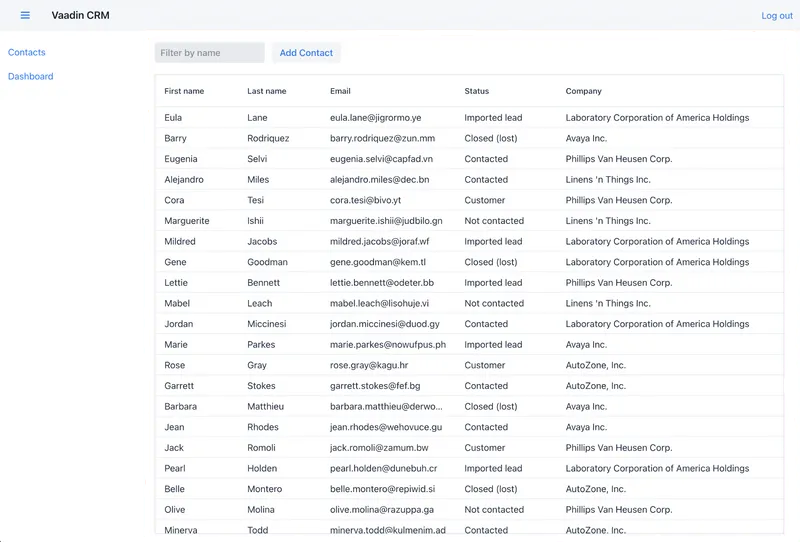

# Custom project from Hilla

This project was created using the [in-depth tutorial](https://hilla.dev/docs/lit/start/in-depth) of the Hilla framework

## Project appearance

## Running the application

The project is a standard Maven project. To run it from the command line,
type `mvnw` (Windows), or `./mvnw` (Mac & Linux), then open
http://localhost:8080 in your browser.

You can also import the project to your IDE of choice as you would with any
Maven project.

## Deploying to Production

To create a production build, call `mvnw clean package -Pproduction` (Windows),
or `./mvnw clean package -Pproduction` (Mac & Linux).
This will build a JAR file with all the dependencies and front-end resources,
ready to be deployed. The file can be found in the `target` folder after the build completes.

Once the JAR file is built, you can run it using
`java -jar target/myapp-1.0-SNAPSHOT.jar` (NOTE, replace
`myapp-1.0-SNAPSHOT.jar` with the name of your jar).

## Useful links

- Read the documentation of Hilla framework at [hilla.dev/docs](https://hilla.dev/docs/).
- Hilla's [Stack Overflow](https://stackoverflow.com/questions/tagged/hilla) and [Discord channel](https://discord.gg/MYFq5RTbBn).
- Hilla's [GitHub](https://github.com/vaadin/hilla).
